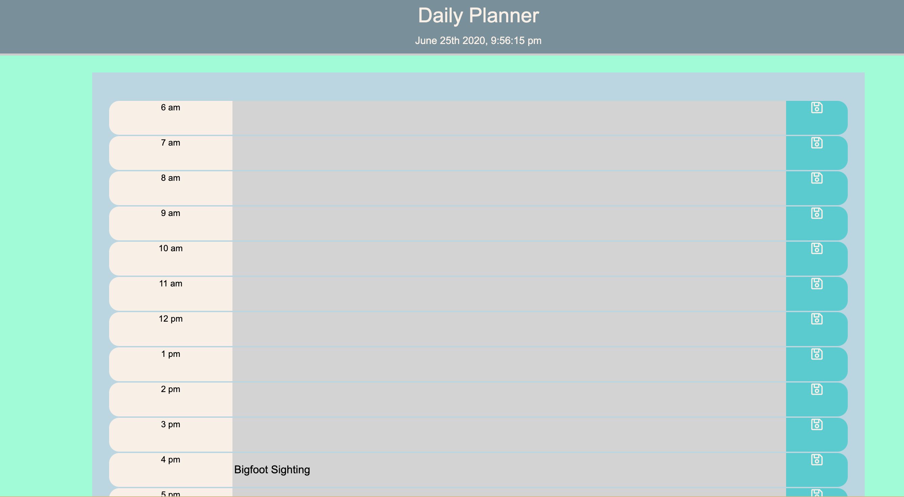

# Day Planner Layout
This basic javascript day planner layout utilizes jquery to build a layout in the DOM and populate it with the hours. The code take the current date and time and that is reflected in the heading as well as the color code of the hour by hour palnner. New events can only be enetered in for future time slots. Saving to local storage is utilized for data retention. 

[Live Site](https://jordanrbunnell.github.io/dayplanner/).

## Screenshot

